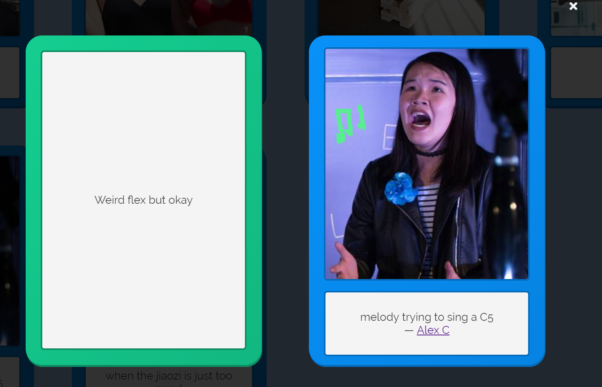

# SnapStack
[snapstack.appspot.com](https://snapstack.appspot.com)

A judge-based card game where players turn friends into memes by customizing images from their social media profiles.

Lead UI/UX Designer: [@melodyphu](https://github.com/melodyphu) (Melody Phu)  
Lead Front-End Engineer: [@bunnybomb123](https://github.com/bunnybomb123) (Chris Chang)  
Lead Back-End Engineer: [@nsinghal7](https://github.com/nsinghal7) (Nikhil Singhal)

^ a card we saved from one of our games ;)
